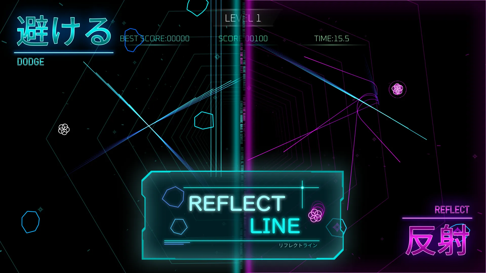
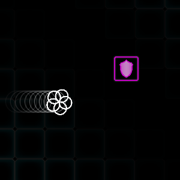
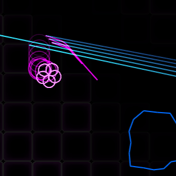
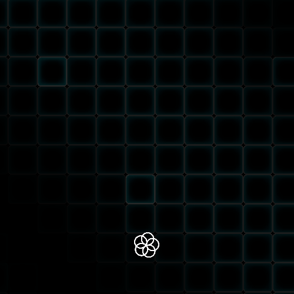
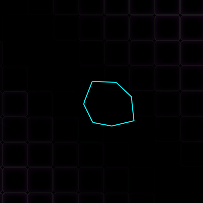

<!-- 
   GitHubの表示を基準にするため、VScode上での表示とは異なる点に注意
-->

   

## 操作説明
### キーボード

### Xboxコントローラ

 

## ゲーム概要

<table>
  <tr>
    <th>開発期間</th>
    <td>2025/4 ~ 2025/10 (現在も改良中)</td>
  </tr>
  <tr>
    <th>開発人数</th>
    <td>2人</td>
  </tr>
  <tr>
    <th>プレイ人数</th>
    <td>1人</td>
  </tr>
  <tr>
    <th>ジャンル</th>
    <td>反撃型回避アクション</td>
  </tr>
  <tr>
    <th>使用技術</th>
    <td>DxLib, C++, Sourcetree</td>
  </tr>
</table>

## ルール
以下のサイクルをゲームオーバーになるまで繰り返すエンドレスゲームです。
最終スコアでハイスコアを競います。

  
  

    <b>1. 避ける</b> 
    障害物に当たると即ゲームオーバー。 
    青いものが障害物の特徴です。
  

 

  
  

    <b>2. 取る</b> 
    上から降ってくるアイテムを取ると、反射モードに変化。 
    画面がピンク色になると、反射モード発動中のサインです。
  

 

  
  

    <b>3. 反射</b> 
    反射モード中は、レーザー系の障害物に当たると跳ね返します。 
    反射モードには制限時間があります。
  

 

  
  

    <b>4. 壊す</b> 
    反射したレーザーは、近くの隕石に自動で追尾します。 
    隕石に命中すると破壊し、スコアを獲得できます。
  

 

これらのルールは、ゲーム本編の「**チュートリアル**」から確認できます。

## こだわりポイント

> ### ネオン風のデザイン

「きれい × かっこいい」をコンセプトにした、個性的なデザインにしています。
青色とピンク色の対比が特徴です。

  

    <b>通常モード</b>
    
  

  

    <b>反射モード</b>
    
  

> ### "動き" を作るアニメーション
ゲームには、常に動いてるものがないと寂しく感じます。
そのため、画面の至る所で常に動きが出るよう、アニメーションを実装しています。

  

    
  

  

    
  

 

> ### 隕石のランダム生成
隕石の形にバリエーションを作るため、独自の隕石生成アルゴリズムを実装しています。
1. 頂点の数を抽選
2. 隕石の中心から各頂点までの距離を抽選
3. 頂点を順番に線で結ぶ

  

> ### 隕石をこわす爽快感

ガラスを壊すような破片の演出と効果音を取り入れています。

現実では、ガラスを壊すことはあまりありません。
ゲームならではの爽快感を表現するため、このような演出を採用しています。

 

> ### ポートフォリオサイト
詳しくはポートフォリオサイトをご覧ください。

https://portfolio-kurosawareo.netlify.app/