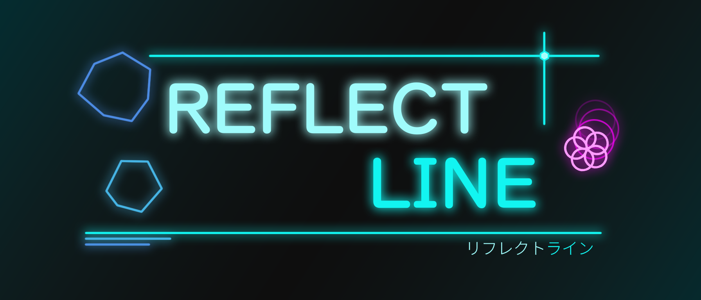
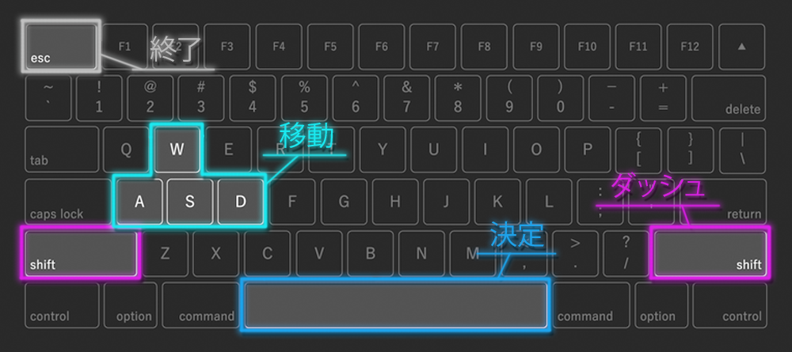
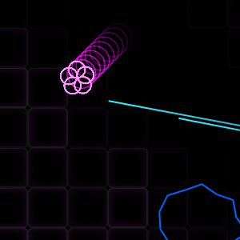
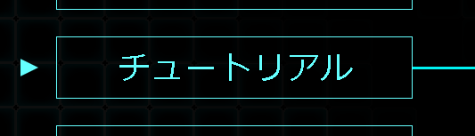
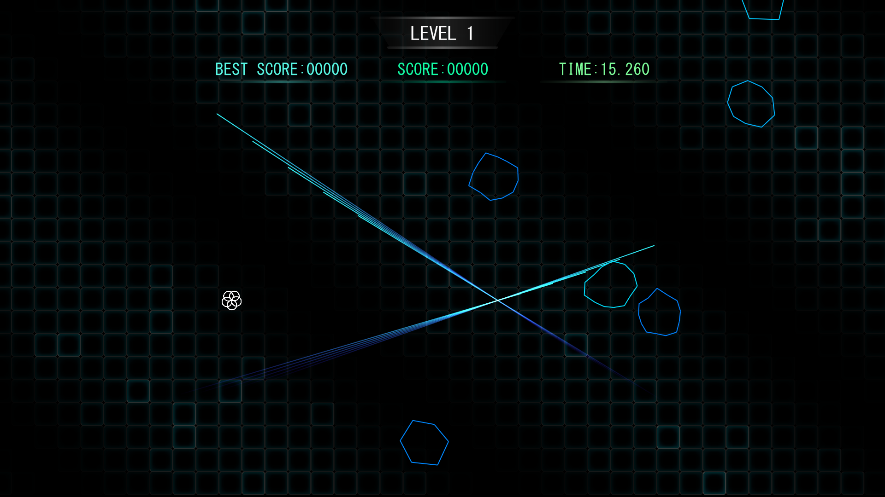
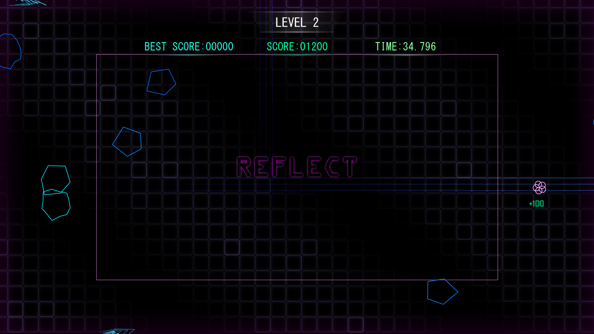
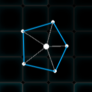
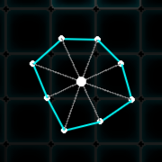
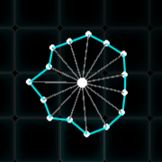
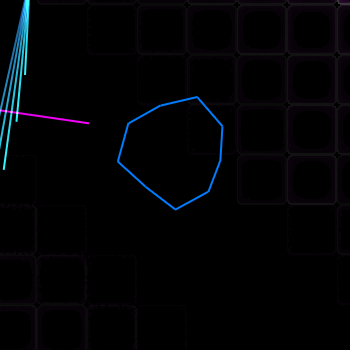

<!-- 
   GitHubの表示を基準にするため、VScode上での表示とは異なる点に注意
-->

   

---
## 操作説明
**キーボード**

**Xboxコントローラ**

 

---
## ゲーム概要

<table>
  <tr>
    <th>開発期間</th>
    <td>2025年4月 ～ 現在</td>
  </tr>
  <tr>
    <th>ジャンル</th>
    <td>反撃型回避アクション</td>
  </tr>
  <tr>
    <th>プレイ人数</th>
    <td>1人</td>
  </tr>
  <tr>
    <th>開発人数</th>
    <td>2人</td>
  </tr>
  <tr>
    <th>操作端末</th>
    <td>キーボード / コントローラ</td>
  </tr>
  <tr>
    <th>使用技術</th>
    <td>C++ / DxLib</td>
  </tr>
</table>

## ルール
以下のサイクルをゲームオーバーになるまで繰り返すエンドレスゲームです。
最終スコアでハイスコアを競います。

  
  

    <b>1. 避ける</b> 
    レーザーや隕石などの障害物に1回でも当たるとゲームオーバー。 
    青いものが障害物のサインです。
  

 

  
  

    <b>2. 取る</b> 
    画面上部からアイテムが降ってきます。 
    アイテムを取ると、反射モードへ変化します。 
    プレイヤーがピンク色になったら、反射モードのサインです。
  

 

  
  

    <b>3. 反射</b> 
    反射モード中は、レーザーにわざと当たりに行くことで反射することができます。 
    ただし、反射モードには制限時間があるため、切れる前に逃げることも重要です。 
    ※レーザーのみ当たってもOKで、無敵ではありません
  

 

  
  

    <b>4. 壊す</b> 
    反射したレーザーは、近くの隕石に向かって自動で追尾します。 
    レーザーが隕石に衝突すると破壊され、スコアを得ることができます。
  

 

これらのルールは、ゲーム本編の『**チュートリアル**』モードからでも確認できます。

## こだわりポイント

> ### ネオン風のデザイン

本作は「きれい × かっこいい」をテーマとした世界観で作りました。
青色とピンク色の対比で、目を惹くデザインが特徴的です。

  

    <b>通常モード</b>
    
  

  

    <b>反射モード</b>
    
  

> ### "動き" を作るアニメーション
本作ではオブジェクトやUIなど、至る所にアニメーションを入れています。
常に何かが動いているため、ゲーム全体の迫力が増しています。

▼`背景アニメーション`

 

▼`レベルアップアニメーション`

 

> ### 隕石
形と線の数は、独自のアルゴリズムでランダムに生成しています。
1. 隕石の線の数を抽選
2. 隕石の中心から、頂点をどのくらいの距離離すかを抽選

  

また、隕石が壊れた時の演出にもこだわり、壊した時の気持ち良さが出るよう工夫しました。

 

> ### KrLib
ゲーム開発を効率化することを目的とした、自作ラッパーライブラリです。

こちらをクリックすると、ライブラリのソースへ移動します。

・[KrLib - DXライブラリ用](https://github.com/KurosawaReo/2025_shinkyu_zenki/tree/main/Csinkyu/KrLib_Dx) 
・[KrLib - C++用](https://github.com/KurosawaReo/2025_shinkyu_zenki/tree/main/Csinkyu/KrLib_cpp) 